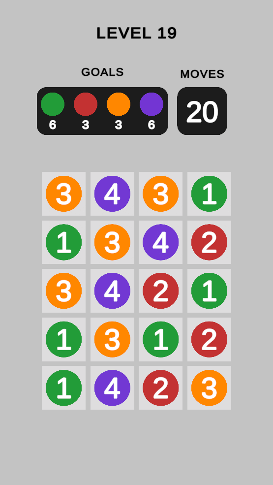



### Main Scene:

You can use the **"Scenes/Main.unity"** file to start the game.

### Game Board Settings:

You can adjust the game board settings from the files under **"Settings/Resources/Boards."** It is possible to add new boards or edit existing ones.

### Goal Settings:

You can configure goal settings to be used in levels from the files under **"Settings/Resources/Goals."**

### Adding a Level:

To add a new level to the game, use the **"LevelConfig"** file under **"Settings/Resources/Configs."** A level consists of **"GoalConfig"** and **"BoardConfig"** files.

### Visual Settings:

To edit colors and particle settings, use the **"VisualConfig"** file under **"Settings/Resources/Configs."**

### Prefab Adjustments:

To edit the prefabs of elements visible in the game, utilize the prefabs under **"Settings/Resources/Prefabs."**